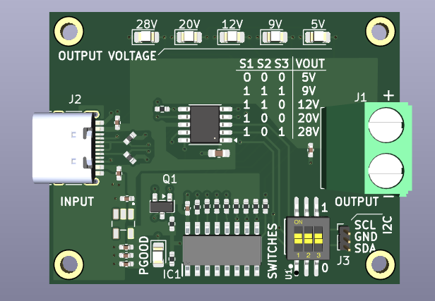
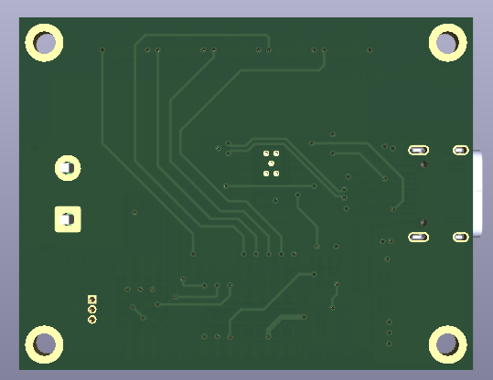
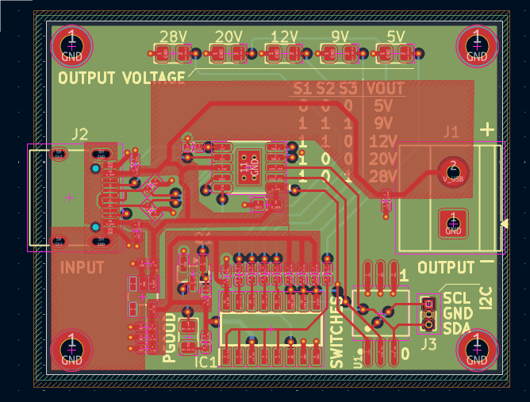
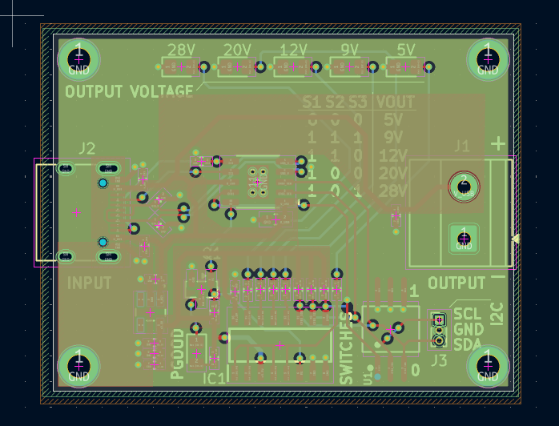
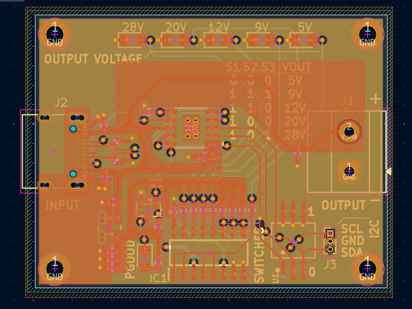
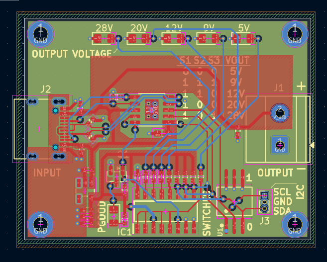

# CH224A USB Power Delivery (PD) Trigger Board

A 4-layer custom printed circuit board designed around the WCH CH224A USB Power Delivery sink controller. This board requests discrete voltage profiles from 5V up to 28V (USB PD 3.0 / 3.1 EPR) at power levels up to 100W, making standard USB-C PD power supplies usable for bench instruments, prototypes, and DC-powered devices.

---

## Board Visuals

### 3D Renders
| Top View | Bottom View |
| :---: | :---: |
|  |  |

---

## Features

* **Wide Voltage Range:** Requests 5V, 9V, 12V, 20V, or 28V output based on switch configuration or digital override.
* **Dual Control Modes:** Manual hardware selection via a 3-position DIP switch, or digital register control over an onboard I2C header.
* **Visual Status Indicators:** Dedicated surface-mount LEDs for each voltage profile (5V, 9V, 12V, 20V, 28V).
* **High-Current Power Path:** Solid copper pours on VBUS and GND pads of the 16-pin USB-C receptacle to reduce resistance and thermal rise under 5A loads.
* **4-Layer PCB Layout:** Dedicated internal ground planes (Layer 2 & Layer 3) provide return paths and heat spreading.
* **Silkscreen Truth Table:** Printed reference table on top silk for direct voltage-setting configuration without consulting external documentation.
* **Output Termination:** 2-pin Phoenix screw terminal block for connection to external loads.

---

## Specifications

| Parameter | Specification |
| :--- | :--- |
| **Input Connector** | 16-Pin USB Type-C Receptacle (`J2`) |
| **Output Connector** | 2-Pin Screw Terminal Block (`J1`) |
| **Controller IC** | WCH CH224A |
| **Supported Voltages** | 5V, 9V, 12V, 20V, 28V (EPR) |
| **Maximum Current** | Up to 5A |
| **Maximum Power** | 100W |
| **Control Interface** | 3-position DIP Switch (`S1`, `S2`, `S3`) & 3-pin I2C Header (`J3`) |
| **Stackup** | 4-layer (Signal / GND / GND / Signal) |

---

## Voltage Selection (DIP Switch Truth Table)

The DIP switch (`S1`, `S2`, `S3`) controls the configuration pins of the CH224A. Use the following logic combinations to select the target output voltage:

| S1 | S2 | S3 | Selected Output Voltage (VOUT) |
| :---: | :---: | :---: | :---: |
| `0` | `0` | `0` | **5V** |
| `1` | `1` | `1` | **9V** |
| `1` | `1` | `0` | **12V** |
| `1` | `0` | `0` | **20V** |
| `1` | `0` | `1` | **28V** |

> **Note:** The truth table is also silkscreened on the top layer of the PCB for quick reference.

---

## PCB Layout & Schematic

### Schematic Diagram
* [View Schematic (PDF)](Images/schematic.pdf)

### Layer Stackup & Routing
| Layer | Layout Image | Description |
| :--- | :---: | :--- |
| **Top Layer (F.Cu)** |  | Signal routing, component placement, voltage LEDs, and `V_USB` power pours. |
| **Inner Layer 1 (In1.Cu)** |  | Continuous Ground Plane (GND). |
| **Inner Layer 2 (In2.Cu)** |  | Continuous Ground Plane (GND). |
| **Bottom Layer (B.Cu)** |  | Low-speed signal routing and DIP switch interconnects. |

---

## Hardware Architecture

### High-Current Design Considerations
* **Solid Copper Pours:** VBUS and GND pads on the USB-C receptacle avoid thermal relief necking to maximize current delivery up to 5A without excessive trace heating.
* **Thermal Management:** Dual internal ground planes serve as an integrated thermal heat spreader for the CH224A IC and power paths.

### Microcontroller Interface (I2C Header - J3)
The `J3` header exposes the I2C bus pins (`SCL`, `GND`, `SDA`) connected to the CH224A controller, allowing an external host MCU (e.g., STM32, ESP32, AVR) to read status registers or programmatically switch profiles.

* **Pinout:**
  1. `SCL` (I2C Clock)
  2. `GND` (Ground)
  3. `SDA` (I2C Data)
* **Bus Pull-ups:** The board omits dedicated pull-up resistors on SDA/SCL to minimize component count. Activate the internal pull-up resistors on the host microcontroller's GPIO pins when using this interface.

---

## Repository File Structure

```text
├── Images/
│   ├── 3d_render_top.png
│   ├── 3d_render_bottom.png
│   ├── pcb_layout_fcu.png
│   ├── pcb_layout_in1.png
│   ├── pcb_layout_in2.png
│   ├── pcb_layout_bcu.png
│   └── schematic.pdf
└── README.md
